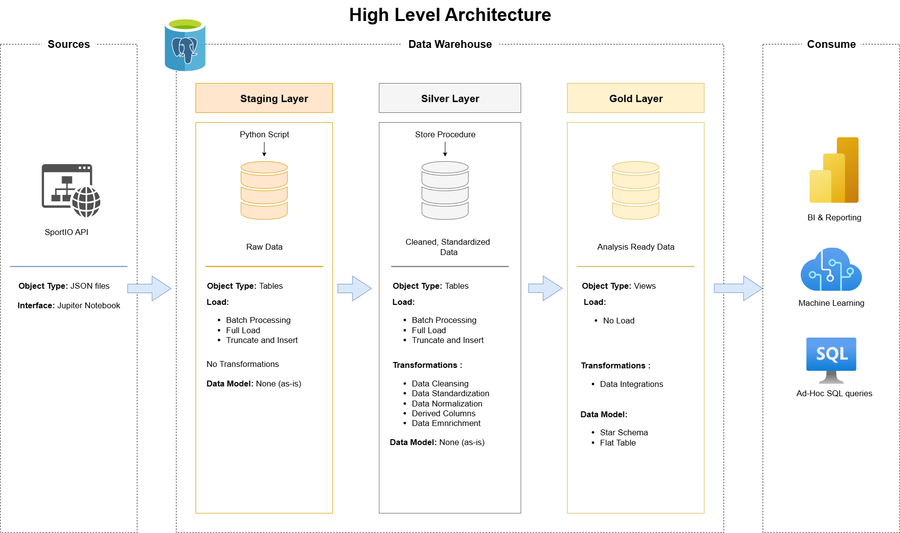

# Data Warehouse and Analytics Project

Welcome to the **Soccer Data Warehouse** repository! 🚀  
This project demonstrates a comprehensive data warehousing solution, from gathering data via API to create a reafy to use database. Designed as a portfolio project, it highlights industry best practices and common tools in data engineering.

---
## 🏗️ Data Architecture

The data architecture for this project follows Medallion Architecture **Staging**, **Silver**, and **Gold** layers:


1. **Bronze Layer**: Stores raw data as-is from the source systems. Data is ingested from SportIO API into SQL Server Database using python.
2. **Silver Layer**: This layer includes data cleansing, standardization, and normalization processes to prepare data for analysis.
3. **Gold Layer**: Houses business-ready data modeled into a star schema required for reporting and analytics.

---
## 📖 Project Overview

This project involves:

1. **Data Architecture**: Designing a Modern Data Warehouse Using Medallion Architecture **Staging**, **Silver**, and **Gold** layers.
2. **ETL Pipelines**: Extracting, transforming, and loading data from source systems into the warehouse.
3. **Data Modeling**: Developing fact and dimension tables optimized for analytical queries.

---


## 🚀 Project Requirements


To run this project, you’ll need:

- **Python 3.8+** (recommended)  
- The following Python packages:  
    pandas
  psycopg2-binary
  python-dotenv
  SQLAlchemy

### 🔹 Install dependencies

Install all required packages with:

pip install -r requirements.txt

### ⚙️ Configuration

This project uses environment variables for database credentials.
Create a .env file in the project root with the following structure:

DB_HOST=localhost
DB_NAME=mydatabase
DB_USER=myuser
DB_PASSWORD=mypassword

### Building the Data Warehouse (Data Engineering)

#### Objective
Develop a modern data warehouse using SQL Server to consolidate sales data, enabling analytical reporting and informed decision-making.

#### Specifications
- **Data Sources**: Import data from two source systems (ERP and CRM) provided as CSV files.
- **Data Quality**: Cleanse and resolve data quality issues prior to analysis.
- **Integration**: Combine both sources into a single, user-friendly data model designed for analytical queries.
- **Scope**: Focus on the spanish 2024 league dataset only; historization of data is not required.
- **Documentation**: Provide clear documentation of the data model to support both business stakeholders and analytics teams.

---

## 📂 Repository Structure
```
data-warehouse-project/
│
│
├── docs/                               # Project documentation and architecture details
│   ├── data_architecture.drawio        # Draw.io file shows the project's architecture
│   ├── data_catalog.md                 # Catalog of datasets, including field descriptions and metadata
│   ├── data_flow.drawio                # Draw.io file for the data flow diagram
│   ├── data_models.drawio              # Draw.io file for data models (star schema)
│  
│
├── scripts/                            # SQL scripts for ETL and transformations
│   ├── staging/                        # Scripts for extracting and loading raw data
│   ├── silver/                         # Scripts for cleaning and transforming data
│   ├── gold/                           # Scripts for creating analytical models
│
├── tests/                              # Test scripts and quality files
│
├── README.md                           # Project overview and instructions
├── LICENSE                             # License information for the repository
├── .gitignore                          # Files and directories to be ignored by Git
└── requirements.txt                    # Dependencies and requirements for the project
```
---


## 📜 License

This project is licensed under the [MIT License](LICENSE).


## 🌟 About Me

Hi there! I'm **Ivan Salazar**.  
Let's stay in touch! Feel free to connect with me on the following platforms:

## ☕ Stay Connected

Let's stay in touch! Feel free to connect with me on the following platforms:

[](https://www.linkedin.com/in/ivan-a-salazar/)

